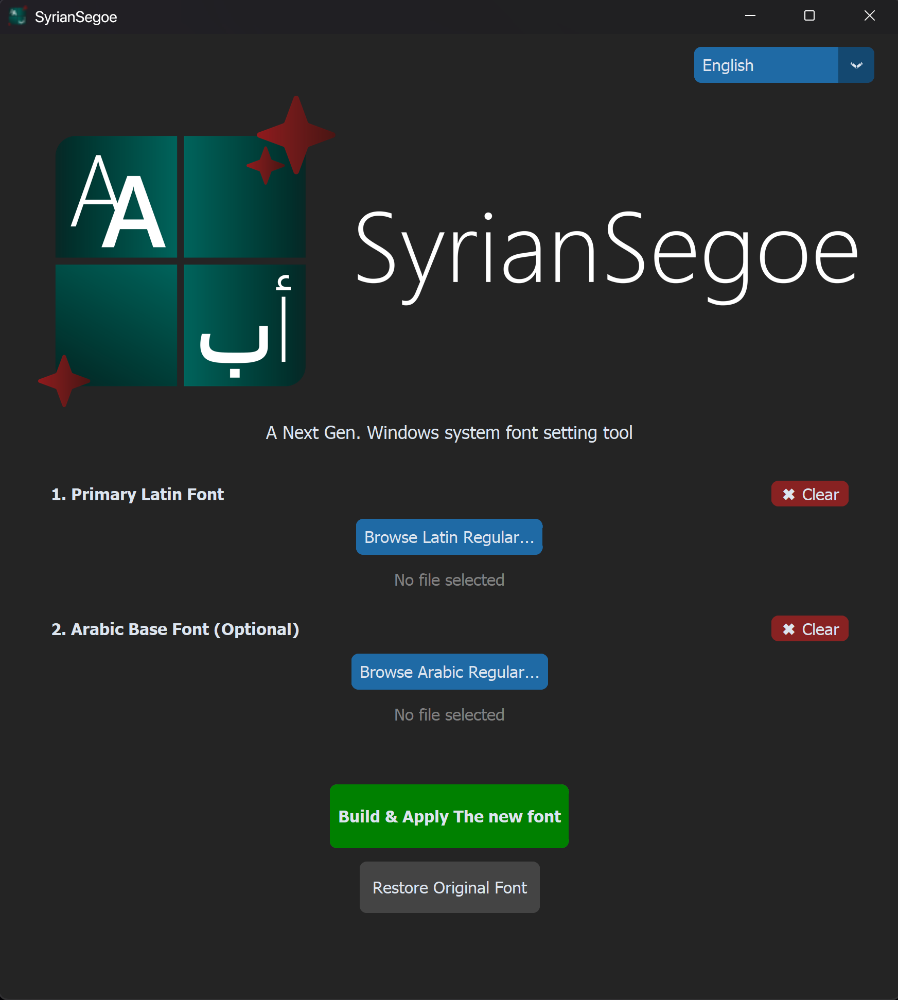
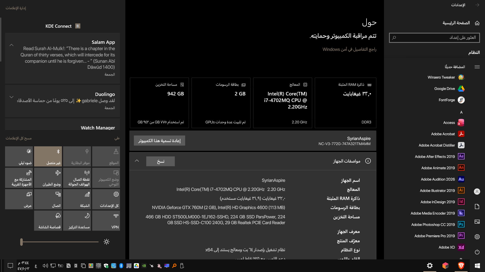
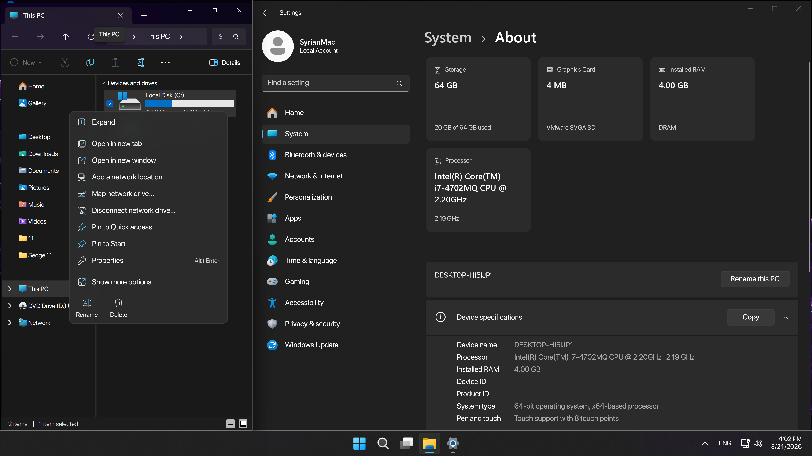
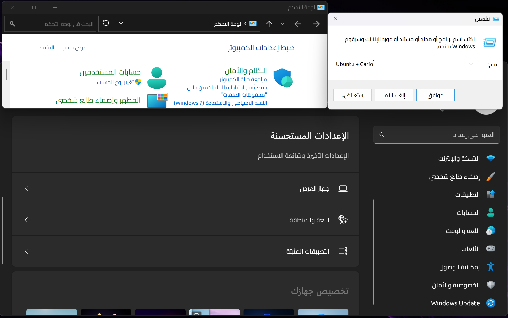
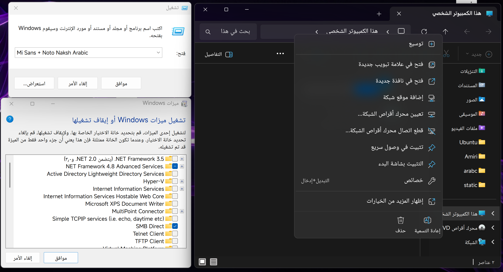
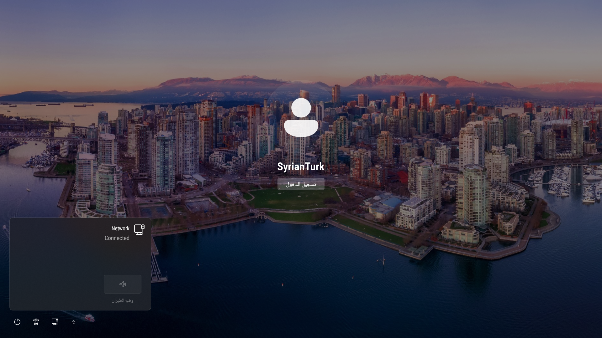
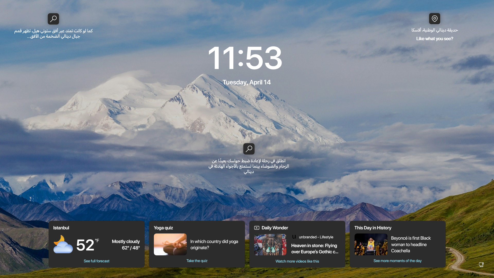

<div align="center">


<br>


</div>

# SyrianSegoe
**A Next-Gen Windows System Font Setting Tool**

SyrianSegoe is a powerful, system-wide font replacement tool for Windows. It completely replaces the default "Segoe UI" font with a modded font of your choice. Because it patches the font files directly, it seamlessly applies your custom font across the entire OS, including modern UI elements that usually resist customization.

<table>
  <tr>
    <td width="50%" valign="top">

## ✨ Features
* **True System-Wide Replacement:** Works flawlessly on UWP apps, the Windows 11 Taskbar, Settings, Welcome and Login UI.
* **Arabic UI Font Support:** Fully supports combining a primary Latin font with a secondary Arabic base font for a perfect bilingual UI.
* **Auto-Detection:** Automatically detects all font weights when you select a Regular font file.
* **Built-in Backup & Restore:** Automatically backs up your original Segoe UI fonts and allows you to restore them with a single click.
* **Multi-language UI:** Available in English, Turkish, and Arabic.

    </td>
    <td width="50%" valign="top">
      
    </td>
  </tr>
</table>
---

## 🆚 Why SyrianSegoe? 
In the past, the standard way to change Windows fonts was using the **Registry `FontSubstitutes` method**. 

**The Problem with `FontSubstitutes`:** Modern Windows components (like UWP apps, the Start Menu, and the modern Taskbar) strictly request the "Segoe UI" font by name and often ignore registry substitutions. This results in a mismatched UI where half the system uses your custom font and the other half uses the default Segoe UI.

**SyrianSegoe** takes a different approach. It uses FontForge to generate a modified version of your chosen font that impersonates Segoe UI. Because the system recognizes it as the original font, it ensures complete UI consistency without breaking system components..

---

## 🔠 Supported Fonts
All fonts designed for UI usage are fully supported, **including Variable Fonts**. Even if your chosen font is missing certain static weights (such as Light or SemiBold), the program will automatically slice or generate the missing weights for you.

### Tested & Verified Fonts
The following fonts have been tested and work beautifully:
* **Latin:** SF Pro Display, MiSans, Ubuntu, Instagram Sans
* **Arabic:** SF Arabic, Noto Naskh Arabic, Cairo


### Tested on:
* **Windows 10:** 21H2
* **Windows 11:** 24H2, 25H2
---

### 📸 Gallery

<table>
  <tr>
    <td width="50%" valign="top">
      <b>SF Pro Display + SF Arabic (Start Menu & Taskbar)</b><br>
      
    </td>
    <td width="50%" valign="top">
      <b>SF Pro Display + SF Arabic (Context Menu)</b><br>
      
    </td>
  </tr>
  <tr>
    <td width="50%" valign="top">
      <b>Ubuntu + Cairo (Win 11)</b><br>
      
    </td>
    <td width="50%" valign="top">
      <b>MiSans + Noto Naskh Arabic</b><br>
      
    </td>
  </tr>
  <tr>
    <td width="50%" valign="top">
      <b>Roboto + NotoNaksh Arabic (Login Screen)</b><br>
      
    </td>
    <td width="50%" valign="top">
      <b>SF Pro Display + SF Arabic (Lock Screen)</b><br>
      
    </td>
  </tr>
</table>

---

## 🚀 Usage

1. **Run as Administrator:** The program requires Admin privileges to modify system fonts.
2. **Select Latin Fonts:** Browse for your primary Latin Regular font. The app will attempt to automatically find the Bold and Black weights in the same folder.
3. **Select Arabic Fonts (Optional):** If you use an Arabic system language or keyboard, select your preferred Arabic fonts in the second section.
4. **Build & Apply:** Click the green "Build & Apply" button. (If you don't have FontForge installed, the app will offer to install it for you automatically via `winget`).
5. **Reboot:** Restart your PC to see the changes take effect system-wide!

*To revert, simply open the app and click **Restore Original Fonts**.*

## 📹 Video Tutorial

[](https://youtu.be/eORmHhQ7ZIA)

---

## 🛠️ Build from Source

1. **Clone the repository:**
   ```bash
   git clone [https://github.com/SyrianTurk/SyrianSegoe.git](https://github.com/SyrianTurk/SyrianSegoe.git)
   cd SyrianSegoe
2. **Install Python dependencies:**
   ```bash
   pip install -r src/requirements.txt
3. **Run the bulid command:**
   ```bash
   python -m PyInstaller --noconfirm --onefile --windowed --uac-admin --icon "logo.ico" --add-data "engine.py;." --add-data "translations.py;." --add-data "SyrianSegoe_Banner.png;." --add-data "logo.ico;." "app.py"

## 🐛 Report a Bug
If you encounter any weird font rendering, app crashes, or bugs, please let me know! 
1. Go to the **[Issues](https://github.com/SyrianTurk/SyrianSegoe/issues)** tab of this repository.
2. Click **New Issue**.
3. Describe the problem, the exact fonts you were trying to use, and your Windows version. Screenshots of the glitch are highly appreciated!

---

## ✅ To-Do List
-  Native UWP UI
-  Font Library
-  Advanced Font Preview
-  Emoji Support

---

## 🤝 Credits & Acknowledgements
* **Developer:** Developed by [SyrianTurk](https://github.com/SyrianTurk).
* **UI Framework:** Built using [CustomTkinter](https://github.com/TomSchimansky/CustomTkinter) by Tom Schimansky.
* **Font Engine:** Font merging, patching, and generation is powered by the incredible open-source [FontForge](https://fontforge.org/) project.
